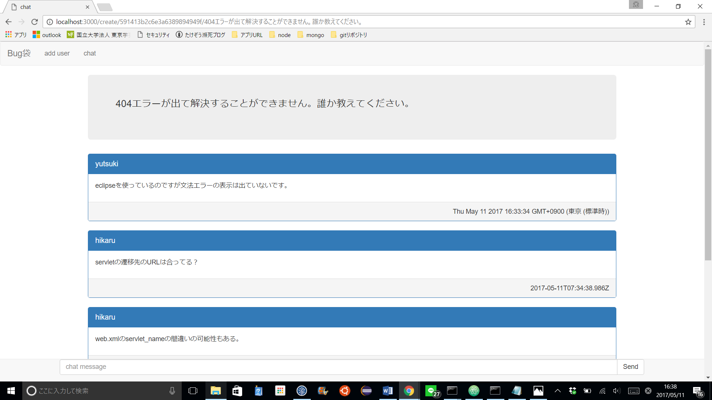

# chat_app
Chat_app is chat application system written by server-side JavaScript ,Node.js.
Chat_app  deployed  to heroku server.
Please use this applecation and write issues about this system.
## チャットアプリはNode.jsで書かれた質問投稿＆チャット解決システムです。
socket.ioを用いてチャット機能を実装しました。
' https://young-mesa-49188.herokuapp.com/ 'まずはこのページでユーザー登録してください。
ユーザーが登録できたらナビゲーションバーのログインボタンをクリックしてログインできます。
ナビゲーションバーのChatボタンでチャットの質問一覧と新しい質問を投稿することが来ます。
一覧から質問を選択するとその質問についてチャットすることができます。
socket.ioを使っているのでチャットを送信すると参加しているメンバー全員の画面が更新されます。

## node_moduleはgitignoreしています。
